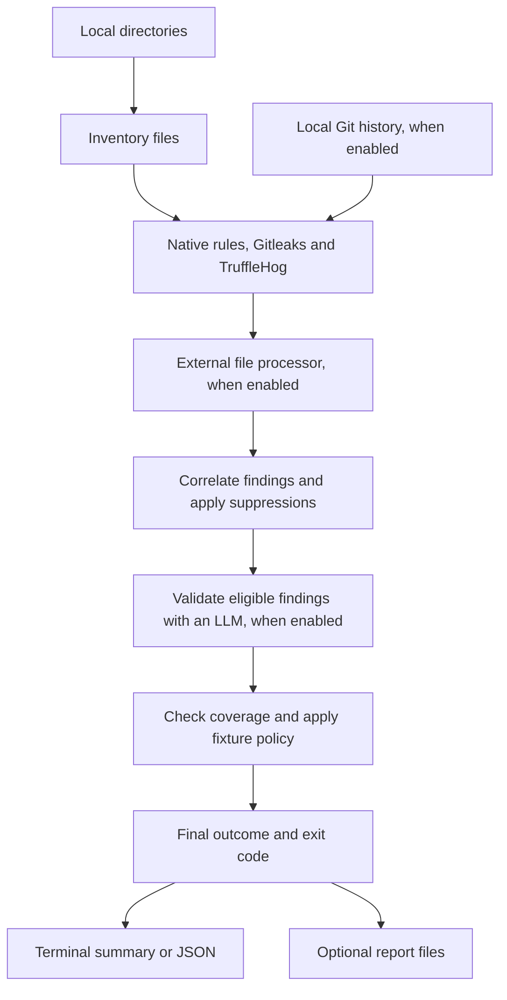

# Clearance

Clearance scans local directories for secrets and sensitive content. It combines
native rules, Gitleaks, TruffleHog, and optional classification into one report
and exit code so you can decide what to fix before sharing a directory.

- **Current files and local Git history:** Find credentials that are still present
  or remain in earlier commits.
- **Optional LLM validation:** Confirm or dismiss findings with their source context.
- **Extensible discovery:** Run your own processing application on every eligible
  current file through a JSON executable interface.
- **Terminal or report output:** Read a summary, save HTML and Markdown reports,
  or consume the full result as JSON.

## How a scan works



External discovery examines eligible current files even when the other scanners
find nothing. LLM validation reviews existing findings; findings discovered only
by the external processor skip that validation stage. Recorded coverage gaps prevent
a clean result. See [scanning behavior](docs/scanning.md) for the full rules.

## Install from source

Use Node.js **22.19 or newer**. The default scan also requires
[Gitleaks](https://github.com/gitleaks/gitleaks) **8.19 or newer** and
[TruffleHog](https://github.com/trufflesecurity/trufflehog) **3.90 or newer** on `PATH`.

```bash
npm ci
npm run build
npm link
clearance --help
```

Without `npm link`, run `node dist/cli.js` instead of `clearance`.
To build a standalone executable, also install Bun **1.3.14 or newer**:

```bash
bun run build:executable
./dist/clearance --help
```

The executable needs no Node.js or Bun at runtime. Enabled external scanners
remain separate dependencies. It embeds the default native and Gitleaks policies
and disables `.env` and `bunfig.toml` autoload.

## First scan

```bash
clearance .                          # current directory, default scanners
clearance path/a path/b               # one result covering several roots
clearance --gitleaks-history .        # also scan local Git history
clearance --no-gitleaks --no-trufflehog .  # disable their current-file scans
```

By default, Clearance writes `manifest.json`, `report.md`, and `report.html` under
`./clearance-report`. Interactive runs also show timestamped progress and raw
live findings on stderr. The final result correlates those findings and applies
policy; live hits are provisional.

| Need                                 | Command                                  |
| ------------------------------------ | ---------------------------------------- |
| Terminal output without report files | `clearance --no-report .`                |
| JSON only, without report files      | `clearance --json --no-report --quiet .` |
| Progress when redirecting output     | `clearance --progress .`                 |
| Final summary without live output    | `clearance --quiet .`                    |
| A different report directory         | `clearance --output ./scan-results .`    |
| Original values in reports and JSON  | `clearance --include-raw .`              |

**Reports and JSON omit raw secret values by default.** Live findings include raw
values when progress is enabled. `--quiet` hides live output; `--include-raw`
controls reports and JSON, not what scanners or the validator receive.

`--json` always emits the complete `clearance.report/v1` result, whether or not
report files are enabled. See [results and troubleshooting](docs/results.md) for
coverage, fixture labels, raw values, and diagnostic traces.

## Configure a scan

Create a TOML file with the settings you want to override.
[`examples/config.toml`](examples/config.toml) shows all sections, including policy
paths that you must adjust for your installation:

```bash
clearance --config /path/to/config.toml .
```

Settings resolve field by field: **CLI flags → environment variables → explicit
configuration → system configuration → built-in defaults**. `--config` takes
precedence over `CLEARANCE_CONFIG` when choosing the explicit file.
`/etc/clearance/config.toml`, when present, remains a lower-priority layer.
Clearance never discovers configuration inside the scanned tree.

The [configuration reference](docs/configuration.md) covers detector switches,
exclusions, severity thresholds, LLM settings, and report options. In particular:

- **LLM validation** is off by default. Enable `[llm].enabled` and configure
  `[model]` to use a compatible endpoint.
- **Test-fixture outcome exclusion** is off by default. `--exclude-test-fixtures`
  keeps scanning and reporting likely fixtures while excluding test-only findings
  from the outcome. A fixture path alone never establishes a false positive.
- **External file processing** is off by default. Configure
  `[detectors.classifier]` to invoke a custom executable. The
  [external processor guide](docs/external-processors.md) includes a runnable
  example and the complete request/response contract.

Scanners run with your privileges. Select trusted executables and keep scanner
configuration outside the directories being scanned. Clearance scans local inputs;
it does not clone repositories.

## Exit codes

| Code | Outcome                  | Meaning                                                |
| ---- | ------------------------ | ------------------------------------------------------ |
| `0`  | `clean`                  | No open findings or recorded coverage gaps             |
| `1`  | `findings`               | Findings below the failure threshold (default: `high`) |
| `2`  | `denied` or `incomplete` | Threshold met, or coverage incomplete                  |
| `3`  | `error`                  | Configuration, detector, or LLM/infrastructure failure |

Exit code `0` means the configured scan cleared its selected scope. The result distinguishes
`denied` from `incomplete`.

## Documentation

- [Configuration](docs/configuration.md): settings, defaults, and overrides.
- [Scanning behavior](docs/scanning.md): inventory, detectors, history, and current coverage limits.
- [Results and troubleshooting](docs/results.md): reports, terminal output,
  coverage, and diagnostics.
- [LLM validation](docs/validation.md): model setup, evidence, verdicts, and traces.
- [External processors](docs/external-processors.md): build a processing
  application for whole-file discovery.
- [Development](docs/development.md): source layout, builds, and local tests.

Run `clearance --help` for the complete CLI flag list.
