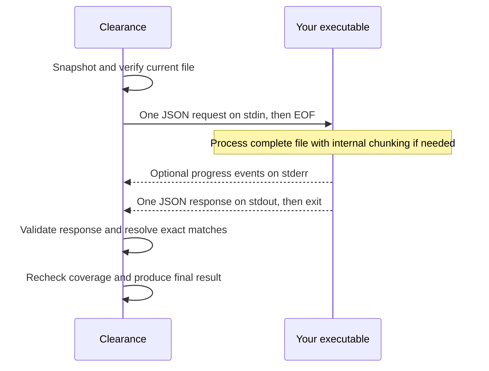

# External file processors

[Overview](../README.md) · [Configuration](configuration.md) · [Scanning](scanning.md) · [Results](results.md)

Clearance can run an executable on each eligible current UTF-8 file to discover
sensitive content. The executable may use local rules, a model, or a remote
service. No shared library or particular runtime is required.

Use this integration when you need whole-file discovery, including files where
native rules, Gitleaks, and TruffleHog find nothing. The processor returns exact
source text; Clearance locates the matches and applies reporting policy.



The processor does not inspect Git history or write sanitized files. Git-history
scanning and Clearance's built-in LLM finding validator remain independent.
Classifier-only findings skip that validator; clusters also found by deterministic
scanners can still be validated. `notFoundBy` lists deterministic scanners only.

## Try the example processor

[`examples/marker-classifier.mjs`](../examples/marker-classifier.mjs) is a working
Node.js processor with no model or service dependency. It recognizes
`EXAMPLE_PRIVATE_` followed by uppercase ASCII letters or digits.

1. Copy [`examples/classifier.toml`](../examples/classifier.toml) to a location
   outside your scan roots.
2. Set `executable` to the absolute Node.js path (`command -v node`). Set the first
   `args` entry to the absolute path of `examples/marker-classifier.mjs`.
3. Build Clearance and scan a small input directory:

```sh
npm ci
npm run build
mkdir -p /tmp/processor-example-input
printf '%s\n' 'note=EXAMPLE_PRIVATE_DEMO' > /tmp/processor-example-input/note.txt
node dist/cli.js --config /absolute/path/to/classifier.toml \
  --no-native --no-gitleaks --no-trufflehog --no-llm \
  --no-report --json --quiet /tmp/processor-example-input
```

Expect one finding and exit `2` (`denied`): the marker meets the example policy's
severity threshold. Remove the marker and rerun to get no findings and exit `0`.

The example has a fixed policy: category `confidential`, reason `private_marker`.
It rejects other policies. It demonstrates the interface and process lifecycle;
it is not a general secret detector or semantic policy interpreter.

## Configure your executable

Use `[detectors.classifier]` in your selected Clearance configuration.
`--classifier` and `--no-classifier` override its `enabled` setting. The
[example configuration](../examples/classifier.toml) contains every processor
setting; see also the [configuration reference](configuration.md).

| Setting or behavior   | Contract                                                             |
| --------------------- | -------------------------------------------------------------------- |
| `executable`          | Absolute path, outside scanned roots                                 |
| `args`                | Literal arguments, with no shell expansion                           |
| Working directory     | `/`; use absolute paths for file arguments                           |
| `env`                 | Child-variable names mapped to parent-variable names                 |
| Inherited environment | Empty except explicitly mapped variables                             |
| `policy`              | Nonempty instructions and categories when enabled                    |
| Configuration keys    | Unknown fields are errors                                            |
| `timeoutMs`           | Deadline for the entire file, including retries and internal batches |

Clearance does not interpret the processor's private configuration or require
particular flags such as `--config` or `--progress`. Your executable chooses its
own arguments and implementation.

Map certificate, proxy, and authentication variables explicitly when needed.
A missing mapped parent variable is a setup failure. These settings do not
publish secret environment values in findings reports. The compiled Clearance
application uses the system CA store and disables dotenv and bunfig autoload;
the child process has its own explicitly configured environment.

If your processor has its own deadline, keep it slightly below Clearance's
`timeoutMs` so it can finish cleanup. Progress events do not extend either deadline.

## Implement a processing application

Each process handles **one request for one file**:

1. Read one UTF-8 JSON document from stdin through EOF. Validate its version,
   file target, and supported policy.
2. Process the complete original text. Chunking, service calls, and local rules
   belong to your executable. Treat incomplete processing as failure.
3. Return exact source substrings with category and reason IDs from the request.
   Findings contain no offsets, rewritten content, or path-only matches.
4. Write one response to stdout. Return `complete` with exit zero only after all
   processing succeeds. On failure, return an error envelope and a nonzero exit.
5. Bound input, output, and runtime. Handle cancellation. Keep source content and
   credentials out of diagnostics; reserve stdout for the response.

### Request

Clearance sends request version **4**:

```json
{
  "version": 4,
  "policy": {
    "instructions": "Find sensitive information.",
    "categories": [
      {
        "id": "business",
        "reasons": ["confidential"],
        "inclusion": [],
        "exclusion": [],
        "examples": []
      }
    ]
  },
  "target": {
    "kind": "file",
    "path": "src/settings.ts",
    "text": "Original file content"
  }
}
```

- `path` is the scan-root-relative POSIX path.
- `text` is the complete original file, including credentials already found by
  other scanners. Known findings are never replaced with placeholders.
- Category descriptions are optional. Category severity remains in Clearance's
  configuration and is omitted from the wire policy.
- Clearance adds no absolute paths, offsets, actions, replacement bytes, or
  provider credentials to the request. Those strings can naturally appear in
  the source text itself.

The processor controls its internal representation, chunking, and aggregation.
Enabling this detector authorizes sending the original file content to it.
`report.includeRaw` controls publication in reports and JSON, not processor input.
The separate finding validator likewise receives original candidates, matched
lines, and surrounding context.

### Successful response

Return response version **2**, status `complete`, and exit zero:

```json
{
  "version": 2,
  "status": "complete",
  "findings": [
    { "text": "exact source substring", "category": "business", "reason": "confidential" }
  ]
}
```

An empty `findings` array means no finding on a completely processed input.
Clearance rejects unknown fields, duplicate keys, invalid UTF-8/Unicode, extra
JSON documents, invalid policy vocabulary, non-source findings, and exceeded
resource limits. Its own limits always apply, even if the processor allows more.

Each finding applies to **every exact occurrence** of its text, including
overlapping matches. This contract cannot select just one identical occurrence
by location. Clearance preserves Unicode and records half-open UTF-8
`byteStart`/`byteEnd` offsets plus line/column coordinates; columns count UTF-16
code units.

Resolution uses a bounded multi-pattern trie and one forward pass to map
coordinates. Trie storage, matching work, and expanded findings are capped.

### Error response

On failure, write a fixed error envelope to stdout and exit nonzero:

```json
{ "version": 2, "status": "error", "code": "configuration_error" }
```

Clearance retains a recognized code as `child-<code>`, such as
`child-configuration_error`. It only accepts an envelope with exactly `version`,
`status`, and `code`. Arbitrary diagnostic text is never copied into the report.

Recognized codes are:

| Group                     | Codes                                                                                       |
| ------------------------- | ------------------------------------------------------------------------------------------- |
| Request and configuration | `invalid_request`, `configuration_error`                                                    |
| Provider                  | `provider_unavailable`, `provider_overloaded`, `provider_refused`, `provider_incomplete`    |
| Result validation         | `invalid_output`, `invalid_output_schema`, `invalid_output_source`, `invalid_output_policy` |
| Resources and lifecycle   | `output_limit`, `deadline`, `cancelled`, `process_failed`, `admission_exhausted`            |

Choose the applicable code; a local rules engine can use `configuration_error`
for an unsupported policy. Malformed failure output still marks the file failed,
but its diagnostic text is not published. Errors and nonzero exits never mean
clean, even if some internal chunks succeeded.

### Optional progress events

The executable can write version-1 JSONL events to stderr:

```json
{ "version": 1, "type": "progress", "stage": "classifying", "completed": 2, "total": 8 }
```

| Field or limit  | Accepted values                                              |
| --------------- | ------------------------------------------------------------ |
| `stage`         | `planning` or `classifying`                                  |
| Counts          | Integers: `0 <= completed <= total <= 16384`                 |
| Planning counts | May both be zero                                             |
| Event size      | At most 1024 bytes                                           |
| Event count     | At most 32770 valid events per process                       |
| Other stderr    | Separately bounded by `maxStderrBytes`; never shown verbatim |

Progress never establishes completion; the validated response and successful exit
remain authoritative. Missing or dropped events do not imply failure.

Clearance renders fixed stage labels and counts. Its `--progress` flag forces
rendering on stderr; `--quiet` hides live output while retaining warnings and
errors. `[report].progress = "auto"` enables it on interactive stderr unless
`--json` is selected; `on` and `off` set explicit defaults.

These options do not change the child arguments. If your processor needs a flag
to emit events, include it in `args`. The example processor uses `--progress`.
Separate [live findings](results.md) can display matched source values when
Clearance's progress output is enabled.

## File eligibility and coverage

The inventory exclusions and `scan.maxFileBytes` apply before classifier limits.
The default inventory maximum is **1 MiB**, even if the classifier's
`maxFileBytes` is larger. Invalid UTF-8, embedded NUL, and file or transport limits
are never handled by silently truncating the text. Empty files complete locally
without invoking the executable.

For eligible files, Clearance captures snapshots before deterministic scanning.
It checks content digests before disclosure, after classification, and before
publishing results, then rechecks the inventory after optional validation.
Detected changes, missing files, and newly discovered input produce incomplete
coverage. See [scanning limitations](scanning.md#current-limitations) for the
inventory's boundaries.

Deterministic matches, including inexact or unavailable candidates, do not change
the processor input or prevent discovery. Canonical PEM identity can help correlate
deterministic findings, but it does not alter the file text sent to the processor.

Reports include `classifier.policyDigest` and per-file states:

| State       | Meaning                                               |
| ----------- | ----------------------------------------------------- |
| `completed` | All original file content was classified              |
| `empty`     | Empty input completed locally                         |
| `excluded`  | Input excluded by classifier eligibility rules        |
| `failed`    | Required classification did not complete successfully |

Glob exclusions are also summarized in inventory counters. A failure preserves
successful files and their findings while preventing a clean outcome:

- **Per-file failures:** Detector status `partial`; incomplete coverage (exit `2`),
  or `denied` (exit `2`) when findings meet the threshold.
- **Setup failures:** Detector status `failed` and operational error (exit `3`),
  for example when an explicitly mapped environment variable is missing.

Cancellation, timeouts, malformed responses, nonzero exits, and incomplete internal
chunks are failures. The finding validator can still assess other deterministic
findings, but its failure policy cannot turn incomplete discovery into a clean
result.
