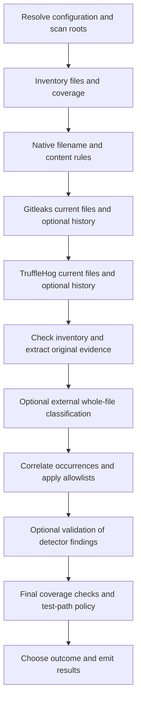

# Scanning and detector behavior

[Overview](../README.md) · [Configuration](configuration.md) · [Results](results.md)

A run inspects local directories and optional local Git history. Clearance reports
findings; it does not rewrite files, clone repositories, create a sanitized copy,
or keep a resumable job between runs.

## Pipeline



The diagram shows stage order, not parallel execution. Disabled stages are
skipped. A detector failure does not erase findings from completed detectors;
it prevents a clean result and skips the direct LLM validation stage.
External classification with partial coverage can still be followed by validation
of other findings.

## Selecting files

Include and exclude globs match POSIX paths relative to each scan root. Patterns
support forms such as `**/*.env`, `src/**`, and `{src,lib}/**`. Quote them in the
shell so Clearance receives the pattern rather than shell-expanded filenames.

```sh
clearance --include '**/*.ts' --exclude 'vendor/**' /path/to/project
```

- Empty `include` means all eligible paths.
- Excludes take precedence and can prune directories.
- Includes select files without preventing traversal of their parent directories.
- The scanned tree's `.gitignore` is not loaded.
- Gitleaks and TruffleHog walk their own input roots. Clearance filters returned
  findings with the same include/exclude rules; these filters do not prevent the
  scanner process itself from reading excluded files.

By default, files over one MiB are classified as oversize. Common media extensions
and files containing NUL in their first 8192 bytes are skipped as harmless.
Archives are identified by the configured extension list and are not unpacked.

| Inventory result                    | Content processing                            | Effect on coverage      |
| ----------------------------------- | --------------------------------------------- | ----------------------- |
| Scannable text                      | Native regex and optional external classifier | Eligible for completion |
| Harmless extension or binary prefix | Skipped by the inventory                      | No coverage gap         |
| Archive                             | No archive-member extraction                  | `incomplete` by default |
| Oversize file                       | Not passed to native regex/classifier         | `incomplete` by default |
| Unreadable file                     | Cannot be read                                | `incomplete` by default |
| Excluded path                       | Outside selected scope                        | No coverage gap         |

`onArchive`, `onOversize`, and `onUnreadable` can each be set to `skip`.
This changes coverage policy, not detector capability. Native filename rules can
still match inventoried archive and oversize entries.

## Native rules

Native rules support filename globs and JavaScript content regexes. TOML rule
files are loaded in sorted filename order from `detectors.native.rulesD`.
Duplicate rule IDs and invalid regexes fail the detector.

```toml
schema_version = "clearance-rules/1"

[[rules]]
id = "private-marker"
type = "regex"
pattern = 'EXAMPLE_PRIVATE_[A-Z0-9]+'
pathGlob = "**/*.txt"
severity = "high"
category = "confidential"
message = "Private marker in a text file"
```

| Field      | Meaning                                   |
| ---------- | ----------------------------------------- |
| `id`       | Unique rule identifier                    |
| `type`     | `glob` or `regex`                         |
| `pattern`  | Filename pattern or content regex         |
| `pathGlob` | Optional file restriction for regex rules |
| `severity` | `low`, `medium`, `high`, or `critical`    |
| `category` | Finding category                          |
| `message`  | Optional human-readable description       |

A glob rule checks both the relative path and its basename. Regex rules process
scannable text with the global flag; capture group 1 is the candidate when
nonempty, otherwise the whole match is used. Later capture groups are not selected. Native rules scan current files,
not Git-history blobs.

Examples: [native policy](../examples/rules.d/default.toml),
[Gitleaks policy](../examples/gitleaks.toml), and
[TruffleHog configuration](../examples/trufflehog.yaml).

## Gitleaks and TruffleHog

Each scanner has separate `enabled` and `history` switches. Working-tree scanning
is enabled by default; history scanning is not.

| Scanner    | Minimum accepted version | Working tree            | Local history             |
| ---------- | ------------------------ | ----------------------- | ------------------------- |
| Gitleaks   | 8.19                     | `gitleaks dir`          | `gitleaks git`            |
| TruffleHog | 3.90                     | `trufflehog filesystem` | `trufflehog git file://…` |

The adapters are tested with Gitleaks 8.30.1 and TruffleHog 3.97.0. Missing or
unsupported binaries fail enabled detectors. Tool subprocesses run with the
invoking user's privileges; Clearance does not sandbox them.

Gitleaks receives explicit configuration and ignore files, `--redact=100`, and
`--max-archive-depth 0`. Its target size limit is derived from `scan.maxFileBytes`,
rounded up to whole MiB. Unredacted Gitleaks secret fields are rejected.

TruffleHog receives `--no-verification`, `--no-update`, and
`--force-skip-archives`. Its output can contain raw fields, but Clearance uses
location and detector metadata, then extracts evidence from the original file or
Git blob. It does not copy native scanner JSON into reports.

TruffleHog does not receive a matching per-file size cap from Clearance, so its
findings can reference files larger than the evidence limit. Such findings may
lack exact extracted evidence. Archive-member paths containing `!` are rejected
by the adapters because Clearance does not extract archive members.

## Git history

```sh
clearance --gitleaks-history --trufflehog-history /path/to/repository
```

Only locally available history is scanned. A removed credential can still cause
a `denied` outcome. History findings carry commit IDs and paths; the report
separates historical-only findings from those still present in current files.

| Root type                      | Behavior                                                                                       |
| ------------------------------ | ---------------------------------------------------------------------------------------------- |
| Ordinary directory             | Working-tree scanning continues; history is skipped                                            |
| Git worktree                   | Enabled current and history detectors run independently                                        |
| Subdirectory of a Git worktree | History scanners use the repository, then findings are restricted to the selected subdirectory |
| Bare repository                | Working-tree detectors are skipped; history detectors can run                                  |

History locations describe scanner-observed introduction/copy events. They are
not a record of every commit in which a value existed. Use
`--show-history-commits` for expanded human-report details.

## Evidence and correlation

An **occurrence** is one detector hit. A **cluster** combines related occurrences
for review. A candidate is the value Clearance can extract from a hit; a matched
line can still be available when extracting an exact candidate fails.

Evidence comes from current files or `git show` for historical locations.
Working-file reads check real-path containment; historical paths are resolved
relative to the containing repository. `llm.batch.contextLines` controls surrounding
lines gathered for validation.

| Extraction status | Meaning                                                                |
| ----------------- | ---------------------------------------------------------------------- |
| `exact`           | A candidate was isolated                                               |
| `inexact`         | Location/context is known, but a precise candidate was not established |
| `unavailable`     | Evidence could not be read                                             |

Exact candidates use HMAC-SHA256 fingerprints with a fresh random key for each
run. The key is not published, and fingerprints are not stable cross-run IDs.
PEM evidence is canonicalized for correlation and allowlisting; this does not
change original text supplied to an external processor.

Within each root, correlation joins matching candidates and nearby working-tree
occurrences. Historical occurrences of the same candidate are associated with
current clusters, or form a historical-only cluster. An inexact hit can join a
single unambiguous overlapping exact candidate; ambiguous matches remain separate.

`foundBy` lists contributing scanners. `notFoundBy` lists completed deterministic
scanners that did not contribute; disabled, failed, and external-classifier stages
are not negative votes. Neither field proves whether a value is a real credential.

Detailed structures: [`types.ts`](../src/types.ts),
[`cluster.ts`](../src/cluster.ts), and [`evidence.ts`](../src/evidence.ts).

## Current limitations

The current implementation has these coverage boundaries:

- The inventory stops at `scan.maxDepth`. Deeper directories and directory-listing
  errors do not currently create coverage findings. A clean result is therefore
  not proof that every descendant was readable and visited.
- Same-root file symlinks are followed. Directory symlinks are not traversed;
  broken or escaping links are skipped as `symlink-escape` without a coverage gap.
- Inventory drift checks compare scannable paths, sizes, and modification times.
  The external classifier additionally checks content snapshots. There is no
  filesystem-wide atomic snapshot.
- The Bun 1.4.2 compiled executable cannot resolve Linux filenames containing a
  literal backslash through its realpath calls. External-classifier coverage marks
  these `snapshot-unavailable`. The JSON protocol supports such names, and the
  Node-based integration tests accept them.
- There is no archive-member scanning, native-rule history scanning, resume, or
  cross-run verdict cache.

For external processor coverage and per-file failures, see
[external processors](external-processors.md). For outcome precedence, see
[results](results.md#outcomes-and-exit-codes).
