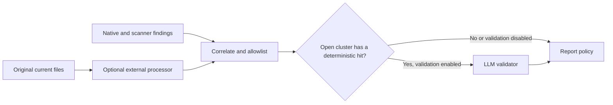

# LLM finding validation

[Overview](../README.md) · [Configuration](configuration.md) · [Results](results.md)

The optional validator evaluates findings already detected by scanners. It does
not search for new findings or replace the separate
[external whole-file processor](external-processors.md).

## Enable validation

Add model settings to a configuration outside the scan roots:

```toml
[model]
api = "chat_completions"
baseURL = "http://127.0.0.1:8000/v1"
model = "local-model"
apiKeyEnv = ""
reasoning = "off"
maxOutputTokens = 2048

[llm]
enabled = true
mode = "validate"
canOverride = false
```

```sh
clearance --config /path/to/config.toml --llm /path/to/project
```

`canOverride = false` keeps verdicts advisory. Enable it with `--llm-override`
or configuration when the model's decisions should affect the final outcome.
The model receives original evidence regardless of report raw-output settings.

## Discovery and validation are separate



Classifier-only clusters skip this stage. Clusters corroborated by a deterministic
scanner can be validated. Allowlisted clusters also skip validation. Historical
scanner findings are eligible; the external processor does not scan Git history.

An enabled detector failure skips validation. A classifier with partial per-file
coverage does not itself skip validation of other findings.

## Model settings

| `[model]` field        | Default                    | Behavior                                                                |
| ---------------------- | -------------------------- | ----------------------------------------------------------------------- |
| `api`                  | `chat_completions`         | Also supports `responses`                                               |
| `baseURL`              | `http://127.0.0.1:8000/v1` | Explicit compatible endpoint                                            |
| `model`                | `local-model`              | Provider model identifier                                               |
| `apiKeyEnv`            | Empty                      | Name of an environment variable holding the credential                  |
| `timeoutMs`            | 30000                      | Per-call timeout supplied to the SDK                                    |
| `maxRetries`           | 1                          | SDK retry budget, allowed range 0–2                                     |
| `reasoning`            | `off`                      | `minimal`, `low`, `medium`, `high`, `xhigh`, or `max` are also accepted |
| `chatTemplateThinking` | Omitted                    | Optional boolean for Chat Completions providers                         |
| `maxOutputTokens`      | 2048                       | Completion budget; `0` leaves it to the provider                        |
| `contextWindow`        | 32000                      | Accepted setting; currently not used to size batches                    |

Provider behavior is selected explicitly, not inferred from the model name.
Reasoning values depend on endpoint support. Chat Completions uses
`max_completion_tokens` and optional `chat_template_kwargs.enable_thinking`;
Responses uses the SDK output-token setting.

When no nonempty credential is selected, the SDK is given a placeholder API key.
An empty `apiKeyEnv` does not promise that the request has no Authorization header.
The SDK's separate trace exporter is disabled; local tracing is opt-in below.

## What the model receives

Each batch contains existing clusters, including:

- Batch and cluster IDs.
- Root ID, relative path, line range, category, severity, and rule description.
- Contributing scanners and observed locations, including commit IDs for history.
- Current/historical presence and whether the value is still in the working tree.
- Available original candidate, matched line, and surrounding source context.

Evidence is not replaced with redaction placeholders. A missing candidate means
Clearance could not isolate one; a source line or surrounding context can still
be present. Internal fingerprints are not sent to the model.

The expected response contains the batch ID and exactly one verdict per cluster:

| Field              | Accepted values                                             |
| ------------------ | ----------------------------------------------------------- |
| `clusterId`        | An ID in the supplied batch                                 |
| `status`           | `confirmed`, `false_positive`, `uncertain`, `needs_context` |
| `confidence`       | Number from 0 through 1                                     |
| `rationale`        | Single line, at most 500 characters                         |
| `severityOverride` | Optional supported severity                                 |
| `duplicateOf`      | Optional cluster ID that exists in this run                 |

Wrong batch IDs, missing/duplicate/unknown cluster IDs, invalid fields, and
unknown duplicate targets reject the response. `duplicateOf` is retained as
verdict metadata; it does not itself merge or suppress clusters.

## Instructions and extra context

Instruction precedence is:

1. `--llm-instructions PATH`.
2. The `[llm].instructions` file.
3. `[llm].instructionsText`.
4. The [built-in instructions](../src/llm/default-instructions.md).

A configured instruction file must be readable. Clearance appends its fixed
contract: classify only supplied clusters, treat evidence as data, return the
required schema, and avoid echoing secrets. The built-in prompt distinguishes
real credentials from synthetic fixtures, placeholders, and public examples.
A test filename is context, not an automatic exemption.

The optional `read_file` tool supplies additional current-file context:

```toml
[llm.tools]
read = true
maxLines = 200
maxCalls = 8
```

Reads are limited to relative paths with findings in the batch, within the supplied
scan roots. They respect `scan.maxFileBytes`, clamp oversized line requests, and
refuse paths that escape a root. Successful reads spend the per-batch call budget;
`maxCalls = 0` disables the tool. It cannot list directories, search, write, or
retrieve arbitrary historical blobs.

For multi-root runs, the tool resolves allowed relative paths across supplied
roots. Identical relative paths in different roots are not disambiguated by a
root ID in the tool request. Run roots separately when that distinction matters.

## Batches

| `[llm.batch]` field | Default | Effect                                          |
| ------------------- | ------: | ----------------------------------------------- |
| `maxTokens`         |    4096 | Estimated JSON payload token budget             |
| `maxClusters`       |      50 | Target maximum clusters per batch               |
| `maxBytes`          |   16384 | Target maximum JSON payload bytes               |
| `contextLines`      |       2 | Evidence lines around the match                 |
| `concurrency`       |       1 | Accepted, but execution is currently sequential |

Clusters are sorted by root, path, line, and cluster ID. A cluster is never split;
an individual cluster larger than a target budget is sent alone. Token estimation
uses `ceil(JSON UTF-8 bytes / 3)` for batch payloads. It does not count the full
system prompt, tool definitions, or provider-specific formatting, and does not
use `model.contextWindow` as an additional cap.

These settings govern finding validation only. External processors manage their
own chunking and model budgets.

## Applying verdicts

| Policy                                            | Current effect                                                                        |
| ------------------------------------------------- | ------------------------------------------------------------------------------------- |
| `canOverride = false`                             | Verdicts are stored as advisory; severity and suppression are unchanged               |
| `canOverride = true`, `false_positive`            | Cluster becomes suppressed                                                            |
| `canOverride = true`, supplied `severityOverride` | Applied on an initially unreviewed cluster, including statuses other than `confirmed` |
| No applicable override                            | Original effective severity is retained                                               |

The severity behavior above reflects the current implementation: an override is
not restricted to confirmed verdicts on the first assessment. Statuses such as
`uncertain` do not automatically clear a finding. Known candidate text is scrubbed
from stored rationales before public reporting.

## Failures and timeouts

`llm.maxRepairs` defaults to 1 and allows 0–2 additional attempts for a rejected
structured response. A repair sends the rejected output and validation diagnostics
back with the same batch. Transport failures are not schema-repair attempts.

`llm.timeoutMs` defaults to a 120000 ms budget for the validation phase. It does
not grow with the number of batches. Remaining findings become `unreviewed` when
the scheduler observes that the budget has expired.

This is not a hard cancellation deadline: each attempt uses the remaining time
measured at the start of its batch, including repair attempts. A repair can
therefore extend beyond the phase budget, and a timed-out SDK call can continue
in the background. `model.timeoutMs` separately configures the provider call.

| `llm.failurePolicy` | Current handling                                                                 |
| ------------------- | -------------------------------------------------------------------------------- |
| `accept` (default)  | Keep accepted verdicts; failed/unattempted batches remain unreviewed             |
| `fallback`          | Discard the phase's verdicts on non-timeout batch failure; use detector findings |
| `fail`              | Discard the phase's verdicts and make the run an error on failure or timeout     |

On timeout, `fallback` retains available verdicts rather than taking its usual
non-timeout fallback path. Setting `partialOnTimeout = false` does not discard
completed verdicts; the setting affects status selection. These are current
behavioral limitations, not alternative guarantees.

Setup exceptions, such as unreadable instructions, become run errors independently
of the ordinary batch failure policy. Live verdicts are provisional; progress
reports when a later failure discards them.

## Diagnostic traces

```sh
clearance --llm-trace validation.jsonl --llm-trace-detail full /path/to/project
```

Relative trace paths resolve inside `report.outputDir`; absolute paths stay
absolute. Tracing writes JSONL and a rendered HTML view, with permissions set to `0600`.
A trailing `.jsonl` is replaced by `.html` (`validation.jsonl` → `validation.html`);
otherwise `.html` is appended. It is independent of report-file enablement:
`--no-report` does not disable an explicitly requested trace.

| Detail     | Contents                                                                                                                  |
| ---------- | ------------------------------------------------------------------------------------------------------------------------- |
| `metadata` | Batch IDs, attempts, timing, acceptance, diagnostics, and tool-call records                                               |
| `full`     | Also requests, parsed responses, system instructions, tool definitions, and available model conversation/response history |

Full traces contain original evidence and may contain model-echoed secrets.
Metadata traces can still contain diagnostic text and paths. Treat traces as
private debugging artifacts and leave `traceFile` empty for terminal-only runs.

Implementation references: [`validate.ts`](../src/llm/validate.ts),
[`schema.ts`](../src/llm/schema.ts), and [`agents.ts`](../src/llm/agents.ts).
